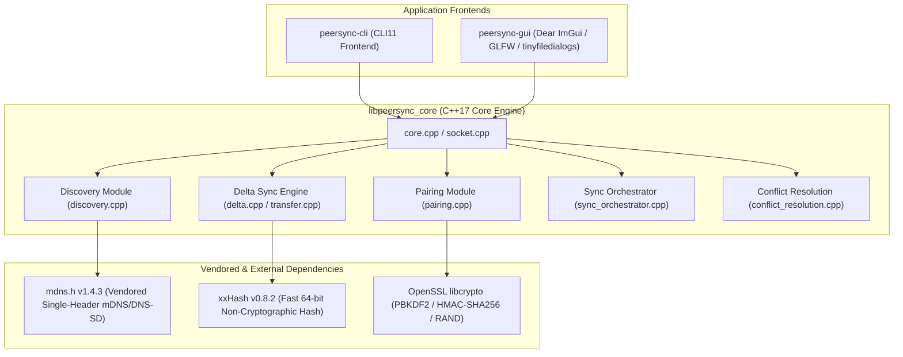

# peersync

[](https://github.com/<owner>/<repo>/actions/workflows/ci.yml)
<!-- NOTE: Replace <owner>/<repo> in the badge URL above with your actual GitHub username and repository name -->

> **Transfer files and sync folders directly between your computers over local Wi-Fi or Ethernet—fast, securely, and without internet, cloud servers, or complicated setup!**

---

## 🌟 Why Use peersync?

- 🚀 **Lightning Fast & Smart**: Send large video files, backups, or entire project directories across your home or office Wi-Fi in seconds. If you edit a file and send it again, `peersync` uses an rsync-style rolling-checksum engine to transmit *only the tiny byte changes*, saving up to **99% of your network bandwidth** and time!
- 🔒 **100% Offline & Private**: Works completely offline on your local network. Your personal files never touch third-party cloud servers, external relays, or the internet.
- ⚡ **Zero Configuration Required**: No IP addresses to memorize, no ports to forward, and no config files to edit. Just open the app, see nearby devices pop up automatically, type the 6-digit PIN, and transfer!
- 🔄 **Seamless Auto-Resume**: Wi-Fi disconnected? Laptop went to sleep or battery died midway through a 5 GB upload? Simply re-run the transfer when you reconnect, and `peersync` resumes exactly where it left off without starting over from scratch!
- 🖥️ **Dual Interfaces**: Includes both an easy-to-use **Graphical App** (`peersync-gui`) for everyday users and a powerful **Command-Line Tool** (`peersync-cli`) for developers, scripts, and headless servers.

---

## ⚡ Quick Start: Download & Run (No Programming Required!)

If you just want to transfer files between your computers without compiling code or touching the terminal, follow these simple steps:

### Step 1: Download the Application
1. Go to the **Releases Page** on this GitHub repository (or check the latest artifact under the **Actions** tab).
2. Download the pre-built package for your operating system:
   - **Windows**: Download `peersync-Windows-package.zip`
   - **macOS (Apple Silicon & Intel)**: Download `peersync-macOS-package.zip`
   - **Linux**: Download `peersync-Linux-package.tar.gz`

### Step 2: Unzip and Launch
- **🪟 Windows**:
  1. Right-click the downloaded `.zip` file and select **Extract All...**.
  2. Open the extracted folder and go into the `bin` directory.
  3. Double-click **`peersync-gui.exe`** to launch the graphical app!
  > *Note: If Windows Defender SmartScreen pops up saying "Windows protected your PC", click **More info** and then click **Run anyway**.*

- **🍎 macOS**:
  1. Double-click the downloaded `.zip` file to expand it.
  2. Open the folder, go into `bin`, and double-click **`peersync-gui`**.
  > *Note: If macOS Gatekeeper warns that the app is from an unidentified developer, right-click (or Control-click) the app icon, select **Open**, and then click **Open** in the dialog box.*

- **🐧 Linux**:
  1. Extract the archive: `tar -zxvf peersync-Linux-package.tar.gz`
  2. Open your terminal, navigate to `bin/`, and run: `./peersync-gui`

---

## 🖥️ How to Use the Graphical App (Step-by-Step for Beginners)

Imagine you want to send a large photo album or video from your **Laptop** to your **Desktop PC**. Here is how easy it is:

### 1️⃣ Get Ready to Receive (On Your Desktop PC)
1. Open **`peersync-gui`** on your Desktop PC.
2. Click the **[ Receive / Accept Mode ]** button in the top menu bar.
3. Click **[ Browse Accept Folder... ]** and choose where you want incoming files to be saved (for example, your `Downloads` or `Desktop` folder).
4. Click **[ Start Listening & Pairing ]**. Your PC is now waiting securely for a connection!

```
+-----------------------------------------------------------------------------------+
|  peersync-gui v0.1.0                            [ Receive / Accept Mode ] [Refresh]|
+-----------------------------------------------------------------------------------+
|  Responder Mode (Listening for Incoming Sync):                                    |
|                                                                                   |
|  Save incoming files to: [ C:\Users\YourName\Downloads\Incoming ] [Browse Folder] |
|                                                                                   |
|  Enter 6-digit PIN displayed on sender's screen: [ _ _ _ _ _ _ ]                  |
|                                                                                   |
|                    [ Start Listening & Pairing ]        [ Cancel ]                |
+-----------------------------------------------------------------------------------+
```

---

### 2️⃣ Connect from Your Sender (On Your Laptop)
1. Open **`peersync-gui`** on your Laptop.
2. Look at the **Discovered Peers on Local Network** table. Within 2 to 3 seconds, your Desktop PC's name will automatically appear in the list!
3. Click the **[ Connect & Transfer ]** button next to your Desktop PC.

```
+-----------------------------------------------------------------------------------+
|  Discovered Peers on Local Network (mDNS/DNS-SD):                                 |
|  +---------------------+-----------------+-------+-----------------------------+  |
|  | Device Name         | IP Address      | Port  | Action                      |  |
|  +---------------------+-----------------+-------+-----------------------------+  |
|  | Desktop-PC          | 192.168.1.100   | 54321 | [ Connect & Transfer ]      |  |
|  | MacBook-Air         | 192.168.1.50    | 48192 | [ Connect & Transfer ]      |  |
|  +---------------------+-----------------+-------+-----------------------------+  |
+-----------------------------------------------------------------------------------+
```

---

### 3️⃣ Pair with a PIN & Transfer!
1. A random 6-digit **Secure Pairing PIN** (for example, `849201`) will appear on your Laptop screen.
2. Look at your Desktop PC screen and type that exact 6-digit PIN into the input box.
3. On your Laptop, click **[ Browse File... ]** or **[ Browse Folder... ]** and select the file or folder you want to send.
4. Click **[ Start Connection & Transfer ]**!

Watch the live progress bar zoom across your screen! When transferring modified files or syncing folders, the **Session Transfer History** table at the bottom shows you exactly how fast the transfer completed and your live **Delta Savings %**.

```
+-----------------------------------------------------------------------------------+
|  Active Sync: photo_album.zip -> Desktop-PC                                       |
|  Progress: [==================================================] 100% (2.1 / 2.1 GB) |
|  Speed: 154.2 MB/s  |  Elapsed: 00:13s  |  Delta Savings: 99.1% (2.08 GB saved!)  |
+-----------------------------------------------------------------------------------+
```

> [!TIP]
> **What is "Delta Savings"?** If you send a 2 GB file to a friend, and later change a few photos inside it and send it again, normal software would re-upload the entire 2 GB file from scratch. **peersync** is smarter: it checks what changed and sends *only the modified pieces*, completing the second transfer in a fraction of a second while saving 99% of the network data!

---

## 💻 Command-Line Interface Guide (`peersync-cli`)

For power users, system administrators, scripts, or headless Linux/UNIX servers, `peersync` provides a full-featured command-line interface.

### 1. `listen` (Advertise & Wait for Incoming Peers)
Starts an mDNS advertiser on your network and binds a listening socket. Displays a random 6-digit PIN when a remote device connects.

```bash
# Listen on an automatically assigned port with a custom device name
peersync listen --name office-server --port 0
```

**Sample Terminal Output:**
```
[INFO] Bounded listening socket to port 54321
[INFO] Advertising service '_peersync._tcp.local.' as 'office-server' on port 54321...
Listening as office-server on port 54321, waiting for peers...
(Press Ctrl+C to stop listening)

[CONNECTION] Incoming TCP connection from 192.168.1.50:49152
[PAIRING] Challenge received. Enter this PIN on the initiating device: 849201
[PAIRING] Authentication successful! Session established with peer.
```

---

### 2. `discover` (Scan Your Local Wi-Fi Subnet)
Queries your local area network (LAN) using multicast DNS to list all currently running `peersync` instances and their IP addresses.

```bash
# Browse for local peers for 5 seconds
peersync discover --timeout 5
```

**Sample Terminal Output:**
```
Browsing for peers for 5 seconds...

Discovered Peers:
Name                            IP Address          Port      
--------------------------------------------------------------
office-server                   192.168.1.100       54321     
macbook-pro                     192.168.1.50        48192     
linux-workstation               192.168.1.200       8000      
--------------------------------------------------------------
```

---

### 3. `send` (Send a File with Delta Sync)
Sends a single file to a discovered device name or direct IP address. Automatically computes delta signatures if the destination already has an older version of the file.

```bash
# Send an archive file to a device discovered via mDNS
peersync send ./backup.tar.gz --to office-server

# Or send directly to an explicit IP and port number
peersync send ./backup.tar.gz --to 192.168.1.100:54321
```

---

### 4. `receive` (Accept an Incoming File)
Listens on a designated port to accept an incoming file transfer, saving it into the `--accept-dir` directory.

```bash
# Listen on port 54321 and save incoming files into ./downloads
peersync receive --port 54321 --accept-dir ./downloads
```

---

### 5. `sync` (Synchronize an Entire Directory Tree)
Recursively synchronizes an entire local folder with a remote peer. Uses multi-threaded worker sockets (`--concurrency`) to transfer multiple files simultaneously and automatically resolves conflicts by modification timestamp.

```bash
# Sync local project directory with 4 concurrent worker threads
peersync sync ./my-project --to office-server --concurrency 4
```

**Sample Terminal Output:**
```
Scanning local directory './my-project'... Found 142 files.
Connecting to 'office-server' at 192.168.1.100:54321...
Enter this PIN on the receiving device: 391042
Pairing successful! Exchanging directory manifests...

[SYNC PLAN] 142 total files evaluated:
  - Skipped (Identical): 138 files
  - To Send (Local Newer): 4 files (src/main.cpp, src/utils.cpp, README.md, build.sh)
  - To Receive (Remote Newer): 0 files

Spawning 4 concurrent worker threads for data transfer...
[Worker 1] Synced 'src/main.cpp' (Saved 94.2% via delta sync)
[Worker 2] Synced 'src/utils.cpp' (Saved 88.5% via delta sync)
[Worker 3] Synced 'README.md' (Literal transfer, 12 KB)
[Worker 4] Synced 'build.sh' (Literal transfer, 1 KB)

Directory sync completed successfully! Total bytes transferred: 48.2 KB (out of 18.5 MB total tree size).
```

---

### 6. `receive-dir` (Accept an Incoming Directory Sync)
Starts a listening socket specifically formatted to accept a recursive directory synchronization session from another peer.

```bash
# Accept incoming folder synchronization into ./mirrored-repo
peersync receive-dir --port 54321 --accept-dir ./mirrored-repo
```

### Useful CLI Modifiers
- `--no-resume`: Ignores existing transfer journals and forces a clean transfer from scratch.
- `--verbose` / `-v`: Enables diagnostic debugging logs, displaying protocol framing headers, rolling window hash offsets, socket timeouts, and network packet structures.

---

## 🛠️ Building from Source (For Developers & Contributors)

If you are a developer looking to contribute, modify the codebase, or compile binaries from source, follow the instructions below.

### Prerequisites
- A **C++17 compatible compiler** (GCC 8+, Clang 8+, or MSVC 2019/2022)
- **CMake 3.15** or newer
- **OpenSSL 3.0+** (development headers and libraries for `libcrypto`)
- **Git**

---

### 1. Linux (Ubuntu / Debian)
Install the required build toolchain, OpenSSL headers, and graphical windowing dependencies (X11/Wayland/Mesa) required by Dear ImGui and GLFW:

```bash
sudo apt-get update
sudo apt-get install -y build-essential cmake git libssl-dev \
    libglfw3-dev libgl1-mesa-dev libx11-dev libxi-dev \
    libxrandr-dev libxcursor-dev libxinerama-dev libwayland-dev libxkbcommon-dev
```

**Configure and compile across all CPU cores:**
```bash
git clone https://github.com/<owner>/<repo>.git peersync
cd peersync

# Configure build with tests and GUI enabled
cmake -S . -B build -DPEERSYNC_BUILD_TESTS=ON -DPEERSYNC_BUILD_GUI=ON
cmake --build build --config Release -j$(nproc)

# Run the automated test suite
ctest --test-dir build --output-on-failure
```

> [!NOTE]
> **Headless Server Build**: If building on a headless Linux server or Docker container without graphical display libraries installed, pass `-DPEERSYNC_BUILD_GUI=OFF` to build only `peersync-cli` and the test suite. See [ubuntu-errors.md](ubuntu-errors.md) for historical build notes and CI troubleshooting logs.

---

### 2. macOS (Apple Silicon M1/M2/M3 & Intel)
Install dependencies via **Homebrew**:

```bash
brew update
brew install cmake openssl@3 glfw
```

**Configure and compile (linking Homebrew OpenSSL):**
```bash
git clone https://github.com/<owner>/<repo>.git peersync
cd peersync

# Provide explicit OpenSSL root directory from Homebrew
cmake -S . -B build \
    -DOPENSSL_ROOT_DIR=$(brew --prefix openssl@3) \
    -DPEERSYNC_BUILD_TESTS=ON \
    -DPEERSYNC_BUILD_GUI=ON

cmake --build build --config Release -j$(sysctl -n hw.ncpu)
ctest --test-dir build --output-on-failure
```

> [!NOTE]
> See [macos-errors.md](macos-errors.md) for Apple-specific linker notes and architecture troubleshooting.

---

### 3. Windows (Windows 10 / 11 x64)
Ensure you have **Visual Studio 2019 or 2022** installed with the **Desktop development with C++** workload enabled, along with CMake and Git. Open an Administrator or Developer PowerShell prompt:

```powershell
# Clone repository
git clone https://github.com/<owner>/<repo>.git peersync
cd peersync

# Configure for 64-bit Windows architecture
cmake -S . -B build -A x64 -DPEERSYNC_BUILD_TESTS=ON -DPEERSYNC_BUILD_GUI=ON

# Build Release binaries
cmake --build build --config Release -- /m

# Run test suite
ctest --test-dir build -C Release --output-on-failure
```

> [!NOTE]
> Windows builds automatically link against native WinSock2 (`ws2_32.lib`), `rpcrt4.lib`, `iphlpapi.lib`, and Windows SDK shell libraries required by `tinyfiledialogs`. See [windows-errors.md](windows-errors.md) for Windows-specific error histories.

---

### CMake Configuration Options

| Option | Default | Description |
| :--- | :---: | :--- |
| `PEERSYNC_BUILD_TESTS` | `ON` | Compiles unit, integration, and fault-injection test suites (`peersync_tests`). |
| `PEERSYNC_BUILD_GUI` | `ON` | Compiles the Dear ImGui desktop application (`peersync-gui`). Set `OFF` for headless CLI builds. |
| `PEERSYNC_BUILD_FUZZERS` | `OFF` | Enables Clang libFuzzer targets (`fuzz_message_deserialization`, `fuzz_reconstruct_file`). |

---

## 🏗️ How It Works & Technical Architecture (For Engineers)

### Full Feature Checklist
- [x] **Automatic Local Network Peer Discovery**: Zero-config device discovery using mDNS/DNS-SD (multicast DNS over UDP port 5353) via vendored `mdns.h`.
- [x] **Secure PIN-Based Pairing & Authentication**: One-time 6-digit numeric PIN challenge-response handshake deriving session keys via PBKDF2-HMAC-SHA256 to authenticate peers before synchronization.
- [x] **Direct Peer-to-Peer Transfer**: Pure LAN/loopback TCP sockets transmitting file data directly between endpoints without external relay servers or internet access.
- [x] **Resumable Transfers & Transactional Journaling**: Automatic `.peersync-journal` and `.peersync-tmp` state tracking allowing interrupted uploads, downloads, and multi-file syncs to resume exactly where they left off after network drops or process restarts.
- [x] **High-Performance Rolling-Checksum Delta Sync**: Custom rsync-style delta algorithm combining Adler-32 rolling window hashes with xxHash64 block signatures to transmit only modified byte chunks and insertions, achieving >99% bandwidth savings on minor edits to large files.
- [x] **Efficient Large New-File Transfer**: Direct streaming pipeline with strictly bounded $O(1)$ memory footprint, guaranteeing blazing-fast delivery for massive files (like video renders or database dumps) without buffering delays or memory exhaustion.
- [x] **Recursive Directory Tree Synchronization**: Lockstep multi-threaded directory catalog exchange with automated two-stage filtering (identical file skipping and **Last-Write-Wins** conflict resolution by modification timestamp).
- [x] **Simultaneous Sync Collision Avoidance**: Deterministic lexicographical tie-breaking (`resolveSimultaneousSyncRole`) preventing protocol deadlocks when two peers attempt to initiate a sync of the same path simultaneously.
- [x] **Network Fault Resilience & Timeout Hardening**: Configurable socket read/write timeouts (default 60s deadline) and strict out-of-order message rejection protecting worker threads from hangs, partial sends, or malformed protocol frames.
- [x] **Command-Line Interface (`peersync-cli` / `peersync`)**: Robust frontend built with CLI11 featuring intuitive subcommands (`listen`, `discover`, `send`, `receive`, `sync`, `receive-dir`).
- [x] **Immediate-Mode Graphical User Interface (`peersync-gui`)**: Sleek desktop interface built with Dear ImGui, GLFW, and native OS file pickers (`tinyfiledialogs`), featuring real-time progress bars, delta savings statistics, and an in-memory session transfer history panel.

### Architecture & Dependency Graph
**peersync** is architected as a modular C++17 library (`libpeersync_core`) wrapped by dual command-line and graphical application frontends.



---

## 🔐 Security Model & Privacy

> [!IMPORTANT]
> **PIN Pairing Authenticates Peers, But Does NOT Encrypt Transport Payloads**

1. **Authentication via Challenge-Response**: Before any file metadata or content is exchanged, peers must complete a cryptographic handshake. When the 6-digit PIN is entered, both sides derive a 256-bit session key using **PBKDF2-HMAC-SHA256** (with a randomized salt and 10,000 iterations) and exchange HMAC challenge proofs (`PairChallenge` -> `PairResponse`). The 6-digit PIN is **never transmitted over the wire**, preventing eavesdropping or replay attacks during authentication.
2. **Cleartext Transport Limitation**: Once authenticated, subsequent protocol communications—including file manifests, relative file paths, rolling-checksum signatures, delta instructions, and raw file payload blocks—are transmitted over TCP sockets in **plain text without transport-layer encryption (TLS/SSL)**.
3. **Recommended Deployment Scope**: Because payload data is unencrypted, `peersync` is designed for **trusted local network segments** (such as home LANs, secure corporate Wi-Fi, direct Ethernet connections, or private VLANs). If you need to synchronize files across untrusted networks or the public internet, you must route `peersync` traffic through an encrypted VPN tunnel (such as **WireGuard**, **Tailscale**, or **OpenSSH port forwarding**).

---

## 📊 Performance Benchmarks & Baseline Numbers

End-to-end performance benchmarks are implemented in `tests/perf_delta_benchmark.cpp` (labeled with `performance` in CTest). Tests evaluate both the in-memory delta processing pipeline (`computeSignatures`, `computeDelta`, and `reconstructFile`) and live network streaming over loopback sockets (`TransferSession`) using 64 KB block sizes on large synthetic binary files featuring dispersed modifications and insertions.

### Observed Baseline Metrics (Windows x64 / NVMe SSD / Loopback Socket)

#### 1. In-Memory Delta Pipeline (64 KB blocks)
| Metric | 250 MB Dataset | 1 GB (1000 MB) Dataset |
| :--- | :---: | :---: |
| **`computeSignatures` Speed** | ~164.4 MB/s | ~142.1 MB/s |
| **`computeDelta` Scanning Speed** | ~153.9 MB/s | ~126.6 MB/s |
| **`reconstructFile` Speed** | ~479.8 MB/s | ~239.8 MB/s |
| **Total End-to-End Throughput** | ~68.2 MB/s | ~52.3 MB/s |
| **Net Bandwidth Savings** | **99.37% saved** | **99.37% saved** |

#### 2. Loopback Socket Streaming (`TransferSession`)
| Metric | 250 MB Dataset | 1 GB Dataset |
| :--- | :---: | :---: |
| **Wall-Clock Transfer Time** | ~9.28 seconds | ~57.5 seconds |
| **Effective Sync Throughput** | ~26.9 MB/s | ~17.4 MB/s |
| **Actual Wire Payload Sent** | ~1.62 MB sent | ~6.78 MB sent |
| **Net Bandwidth Savings** | **>99.35% saved** | **>99.35% saved** |

> [!TIP]
> **Key Takeaway**: When syncing a 1 GB file with a 1% modification footprint, `peersync` transmits only **~6.78 MB of network payload** instead of sending the entire 1,000 MB file over the wire!

---

## ⚠️ Known Limitations

1. **No Full Transport Encryption**: PIN pairing authenticates the session and derives a shared secret, but subsequent data payloads are transmitted over unencrypted TCP sockets. Use on trusted LAN segments or wrap in a VPN tunnel for untrusted networks.
2. **Last-Write-Wins (LWW) Conflict Policy**: Recursive directory synchronization resolves conflicts purely by comparing file modification timestamps (`mtime`). If two peers edit the same file simultaneously without timestamp divergence, the local initiator's file takes precedence in push/bidirectional modes. Three-way merge or content-level diff resolution is not supported.
3. **LAN Subnet / Broadcast Domain Requirement**: Automatic peer discovery relies on UDP multicast mDNS/DNS-SD (port 5353). Both peers must reside on the same physical subnet, broadcast domain, or virtual LAN (VLAN). Devices separated by routers or firewalls blocking UDP multicast will not appear in discovery tables (though direct `IP:Port` transfers via `send --to IP:Port` will still work if TCP routing is permitted).
4. **Single-Writer File Locking**: On operating systems enforcing mandatory file-sharing locks (such as Windows), attempting to synchronize a file that is actively opened for exclusive write access by another running application (such as an active database or virtual machine disk image) will result in a file-access error until the external handle is released.

---

## Contributing

We welcome community contributions! Please review [CONTRIBUTING.md](CONTRIBUTING.md) for details on setting up your local development environment, coding standards, pull request workflows, and test execution requirements.

---

## License

This project is open-source software distributed under the terms of the project license. Vendored dependencies in `third_party/` are distributed under their respective permissive open-source licenses (`mdns.h` under Public Domain; `tinyfiledialogs` under zlib License).
