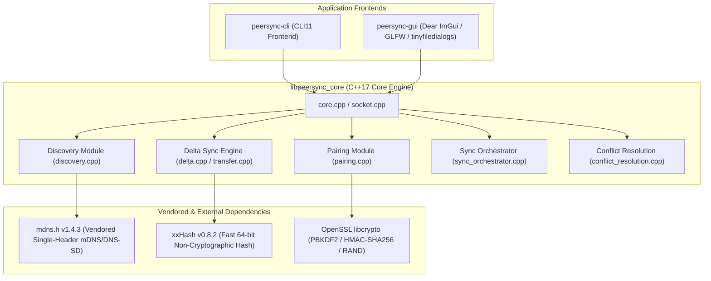

# peersync

[](https://github.com/<owner>/<repo>/actions/workflows/ci.yml)
<!-- NOTE: Replace <owner>/<repo> in the badge URL above with your actual GitHub username and repository name -->

> **Status: Early Development & Hardened Protocol Preview**

**peersync** is a fast, autonomous local-network (LAN) file and directory synchronization tool that lets you transfer data directly between devices with **zero internet connection, no cloud servers, and no complex configuration**. Powered by an rsync-style rolling-checksum delta engine, peersync automatically discovers other instances on your network, authenticates sessions via secure PIN pairing, resumes interrupted transfers seamlessly, and transmits only the modified bytes of changed files over the wire.

---

## Full Feature List

- [x] **Automatic Local Network Peer Discovery**: Zero-config device discovery using mDNS/DNS-SD (multicast DNS over UDP port 5353) via vendored `mdns.h`.
- [x] **Secure PIN-Based Pairing & Authentication**: One-time 6-digit numeric PIN challenge-response handshake deriving session keys via PBKDF2-HMAC-SHA256 to authenticate peers before synchronization.
- [x] **Direct Peer-to-Peer Transfer**: Pure LAN/loopback TCP sockets transmitting file data directly between endpoints without external relay servers or internet access.
- [x] **Resumable Transfers & Transactional Journaling**: Automatic `.peersync-journal` and `.peersync-tmp` state tracking allowing interrupted uploads, downloads, and multi-file syncs to resume exactly where they left off after network drops or process restarts.
- [x] **High-Performance Rolling-Checksum Delta Sync**: Custom rsync-style delta algorithm combining Adler-32 rolling window hashes with xxHash64 block signatures to transmit only modified byte chunks and insertions, achieving >99% bandwidth savings on minor edits to large files.
- [x] **Recursive Directory Tree Synchronization**: Lockstep multi-threaded directory catalog exchange with automated two-stage filtering (identical file skipping and **Last-Write-Wins** conflict resolution by modification timestamp).
- [x] **Simultaneous Sync Collision Avoidance**: Deterministic lexicographical tie-breaking (`resolveSimultaneousSyncRole`) preventing protocol deadlocks when two peers attempt to initiate a sync of the same path simultaneously.
- [x] **Network Fault Resilience & Timeout Hardening**: Configurable socket read/write timeouts (default 60s deadline) and strict out-of-order message rejection protecting worker threads from hangs, partial sends, or malformed protocol frames.
- [x] **Command-Line Interface (`peersync-cli` / `peersync`)**: Robust frontend built with CLI11 featuring intuitive subcommands (`listen`, `discover`, `send`, `receive`, `sync`, `receive-dir`).
- [x] **Immediate-Mode Graphical User Interface (`peersync-gui`)**: Sleek desktop interface built with Dear ImGui, GLFW, and native OS file pickers (`tinyfiledialogs`), featuring real-time progress bars, delta savings statistics, and an in-memory session transfer history panel.

---

## Architecture & Dependency Graph

**peersync** is architected as a clean modular library (`libpeersync_core`) wrapped by dual command-line and graphical application frontends. All network framing, cryptographic handshakes, delta computations, and worker pool orchestrations reside inside the core C++17 library.



---

## Security Model

> [!IMPORTANT]
> **PIN Pairing Authenticates Peers, But Does NOT Encrypt Transport Payloads**

The security architecture of **peersync** is designed specifically to prevent unauthorized LAN devices from initiating connections, reading directory listings, or transferring files:

1. **Authentication via Challenge-Response**: Before any file metadata or content can be exchanged, peers must complete a cryptographic handshake. The receiving device generates a random 6-digit PIN. When entered on the initiating device, both sides derive a 256-bit session key using **PBKDF2-HMAC-SHA256** (with a randomized salt and 10,000 iterations). Peers exchange cryptographic nonces and HMAC proofs (`PairChallenge` -> `PairResponse`). The 6-digit PIN is **never transmitted over the wire**, preventing eavesdropping or replay attacks during authentication.
2. **Cleartext Transport Limitation**: Once the pairing handshake succeeds and the peer is authenticated, subsequent protocol communications—including file manifests, relative file paths, rolling-checksum signatures, delta instructions, and raw file payload blocks—are transmitted over TCP sockets in **plain text without transport-layer encryption (TLS/SSL)**.
3. **Recommended Deployment Scope**: Because payload data is unencrypted, `peersync` should be deployed on **trusted local network segments** (such as home LANs, secure corporate Wi-Fi, direct Ethernet connections, or private VLANs). If you need to synchronize sensitive files across untrusted networks or the public internet, you must route `peersync` traffic through an encrypted VPN tunnel (such as **WireGuard**, **Tailscale**, or **OpenSSH port forwarding**).

---

## Build Instructions

### Prerequisites
- A **C++17 compatible compiler** (GCC 8+, Clang 8+, or MSVC 2019/2022)
- **CMake 3.15** or newer
- **OpenSSL 3.0+** (development headers and libraries for `libcrypto`)
- **Git**

---

### 1. Linux (Ubuntu / Debian)
Install the required build toolchain, OpenSSL headers, and X11/Wayland windowing dependencies required by Dear ImGui and GLFW:

```bash
sudo apt-get update
sudo apt-get install -y build-essential cmake git libssl-dev \
    libglfw3-dev libgl1-mesa-dev libx11-dev libxi-dev \
    libxrandr-dev libxcursor-dev libxinerama-dev libwayland-dev libxkbcommon-dev
```

**Configure and build the project:**
```bash
git clone https://github.com/<owner>/<repo>.git peersync
cd peersync

# Configure build with tests and GUI enabled
cmake -S . -B build -DPEERSYNC_BUILD_TESTS=ON -DPEERSYNC_BUILD_GUI=ON

# Compile across all CPU cores
cmake --build build --config Release -j$(nproc)

# Execute the test suite
ctest --test-dir build --output-on-failure
```

> [!TIP]
> **Headless Server Build**: If building on a headless Linux server or Docker container without graphical libraries, pass `-DPEERSYNC_BUILD_GUI=OFF` to build only `peersync-cli` and `peersync_tests`. See [ubuntu-errors.md](ubuntu-errors.md) for historical build notes and CI troubleshooting logs.

---

### 2. macOS (Apple Silicon M1/M2/M3 & Intel)
Install dependencies via **Homebrew**:

```bash
brew update
brew install cmake openssl@3 glfw
```

**Configure and build (linking Homebrew OpenSSL):**
```bash
git clone https://github.com/<owner>/<repo>.git peersync
cd peersync

# Explicitly provide OpenSSL root directory from Homebrew
cmake -S . -B build \
    -DOPENSSL_ROOT_DIR=$(brew --prefix openssl@3) \
    -DPEERSYNC_BUILD_TESTS=ON \
    -DPEERSYNC_BUILD_GUI=ON

# Compile and run tests
cmake --build build --config Release -j$(sysctl -n hw.ncpu)
ctest --test-dir build --output-on-failure
```

> [!NOTE]
> See [macos-errors.md](macos-errors.md) for Apple-specific linker notes and architecture troubleshooting.

---

### 3. Windows (Windows 10 / 11 x64)
Ensure you have **Visual Studio 2019 or 2022** installed with the **Desktop development with C++** workload enabled, along with CMake and Git. Open an Administrator or Developer PowerShell prompt:

```powershell
# Clone repository
git clone https://github.com/<owner>/<repo>.git peersync
cd peersync

# Configure for 64-bit Windows architecture
cmake -S . -B build -A x64 -DPEERSYNC_BUILD_TESTS=ON -DPEERSYNC_BUILD_GUI=ON

# Build Release binaries
cmake --build build --config Release -- /m

# Run test suite
ctest --test-dir build -C Release --output-on-failure
```

> [!NOTE]
> Windows builds automatically link against native WinSock2 (`ws2_32.lib`), `rpcrt4.lib`, `iphlpapi.lib`, and Windows SDK shell libraries required by `tinyfiledialogs`. See [windows-errors.md](windows-errors.md) for Windows-specific error histories.

---

### CMake Configuration Options

| Option | Default | Description |
| :--- | :---: | :--- |
| `PEERSYNC_BUILD_TESTS` | `ON` | Compiles unit, integration, and fault-injection test suites (`peersync_tests`). |
| `PEERSYNC_BUILD_GUI` | `ON` | Compiles the Dear ImGui desktop application (`peersync-gui`). Set `OFF` for headless CLI builds. |
| `PEERSYNC_BUILD_FUZZERS` | `OFF` | Enables Clang libFuzzer targets (`fuzz_message_deserialization`, `fuzz_reconstruct_file`). |

---

## Full CLI Reference (`peersync` / `peersync-cli`)

The command-line interface provides six primary subcommands for peer discovery, file transfer, and directory synchronization.

### 1. `listen` (Advertise & Wait for Peers)
Starts an mDNS service advertiser (`_peersync._tcp.local.`) and binds a TCP listening socket. Displays a random 6-digit PIN when a remote peer attempts to connect.

```bash
# Listen on an ephemeral port with custom device name
peersync listen --name office-desktop --port 0
```

**Sample Output:**
```
[INFO] Bounded listening socket to port 54321
[INFO] Advertising service '_peersync._tcp.local.' as 'office-desktop' on port 54321...
Listening as office-desktop on port 54321, waiting for peers...
(Press Ctrl+C to stop listening)

[CONNECTION] Incoming TCP connection from 192.168.1.50:49152
[PAIRING] Challenge received. Enter this PIN on the initiating device: 849201
[PAIRING] Authentication successful! Session established with peer.
```

---

### 2. `discover` (Scan Local Network Subnet)
Queries the local network subnet via mDNS/DNS-SD for advertised peers over a configurable timeout duration (default: 3 seconds).

```bash
# Scan for local peers for 5 seconds
peersync discover --timeout 5
```

**Sample Output:**
```
Browsing for peers for 5 seconds...

Discovered Peers:
Name                            IP Address          Port      
--------------------------------------------------------------
office-desktop                  192.168.1.100       54321     
macbook-pro                     192.168.1.50        48192     
linux-homeserver                192.168.1.200       8000      
--------------------------------------------------------------
```

---

### 3. `send` (Transfer File with Delta Sync)
Initiates a single-file transfer to a discovered peer name or explicit `IP:Port` address. Automatically computes rolling-checksum delta signatures if the destination peer already possesses an older or partial version of the file.

```bash
# Send archive to peer discovered via mDNS
peersync send ./archive.tar.gz --to office-desktop

# Send file directly to an explicit IP and port
peersync send ./archive.tar.gz --to 192.168.1.100:54321
```

**Sample Output:**
```
Looking up peer 'office-desktop' via mDNS...
Found 'office-desktop' at 192.168.1.100:54321
Connecting to 192.168.1.100:54321...
Enter this PIN on the receiving device: 849201
Pairing successful! Starting transfer of 'archive.tar.gz'...

[PROGRESS] Transmitting signatures & delta blocks...
Progress: 5.2 MB sent of 500.0 MB (100% complete)
Sent 5.2 MB of 500.0 MB file (98.9% saved via delta sync)
Transfer completed successfully! Verified hash: e3b0c44298fc1c149afbf4c8996fb92427ae41e4649b934ca495991b7852b855
```

---

### 4. `receive` (Listen & Accept Single File)
Starts a listening socket specifically formatted to accept a single incoming file transfer, saving the output into `--accept-dir` (defaulting to the current working directory).

```bash
# Listen on port 54321 and save incoming files to ./incoming
peersync receive --port 54321 --accept-dir ./incoming
```

**Sample Output:**
```
Listening for incoming file transfer on port 54321...
Incoming connection from 192.168.1.50...
Enter PIN displayed on peer: 849201
Pairing successful! Receiving file into './incoming'...

[PROGRESS] Receiving delta blocks and reconstructing 'archive.tar.gz'...
Received 500.0 MB (reconstructed from 5.2 MB network payload).
Transfer completed successfully! Saved file hash: e3b0c44298fc1c149afbf4c8996fb92427ae41e4649b934ca495991b7852b855
```

---

### 5. `sync` (Synchronize Directory Tree)
Initiates a multi-file recursive directory synchronization against a remote peer. Supports concurrent worker socket threads (`--concurrency`) and Last-Write-Wins conflict resolution.

```bash
# Sync local project directory with 4 concurrent worker threads
peersync sync ./my-project --to office-desktop --concurrency 4
```

**Sample Output:**
```
Scanning local directory './my-project'... Found 142 files.
Connecting to 'office-desktop' at 192.168.1.100:54321...
Enter this PIN on the receiving device: 391042
Pairing successful! Exchanging directory manifests...

[SYNC PLAN] 142 total files evaluated:
  - Skipped (Identical): 138 files
  - To Send (Local Newer): 4 files (src/main.cpp, src/utils.cpp, README.md, build.sh)
  - To Receive (Remote Newer): 0 files

Spawning 4 concurrent worker threads for data transfer...
[Worker 1] Synced 'src/main.cpp' (Saved 94.2% via delta sync)
[Worker 2] Synced 'src/utils.cpp' (Saved 88.5% via delta sync)
[Worker 3] Synced 'README.md' (Literal transfer, 12 KB)
[Worker 4] Synced 'build.sh' (Literal transfer, 1 KB)

Directory sync completed successfully! Total bytes transferred: 48.2 KB (out of 18.5 MB total tree size).
```

---

### 6. `receive-dir` (Listen & Accept Directory Tree)
Starts a listening socket to accept an incoming recursive directory synchronization session, mirroring files into `--accept-dir`.

```bash
# Accept incoming directory sync into ./mirrored-repo
peersync receive-dir --port 54321 --accept-dir ./mirrored-repo
```

**Sample Output:**
```
Listening for incoming directory sync on port 54321...
Incoming connection from 192.168.1.50...
Enter PIN displayed on peer: 391042
Pairing successful! Synchronizing into './mirrored-repo'...

[SYNC PLAN] Manifest exchange complete. 4 files scheduled for update across 4 worker threads.
[PROGRESS] Updating local workspace... 4 / 4 files synchronized.
Directory synchronization completed successfully!
```

---

### Global CLI Flags & Modifiers

- `--no-resume`: Bypasses `.peersync-journal` checking, discarding any prior partial downloads and forcing a clean transfer from scratch.
- `--verbose` / `-v`: Enables high-verbosity diagnostic logging, displaying frame header bytes, rolling window hash offsets, socket timeouts, and mDNS packet structures.

---

## GUI Usage Guide & Workflow (`peersync-gui`)

The graphical desktop client (`peersync-gui`) wraps the core library in an intuitive, immediate-mode windowing interface built with Dear ImGui and GLFW.

### 1. Launching & Real-Time Discovery
When opened, the GUI automatically begins broadcasting mDNS advertisements while listening for peers on your local subnet. The **Discovered Peers** table updates dynamically as devices join or leave the network.

```
+-----------------------------------------------------------------------------------+
|  peersync-gui v0.1.0-alpha                      [Receive / Accept Mode]  [Refresh]|
+-----------------------------------------------------------------------------------+
|  Discovered Peers on Local Network (mDNS/DNS-SD):                                 |
|  +---------------------+-----------------+-------+-----------------------------+  |
|  | Device Name         | IP Address      | Port  | Action                      |  |
|  +---------------------+-----------------+-------+-----------------------------+  |
|  | office-desktop      | 192.168.1.100   | 54321 | [ Connect & Transfer ]      |  |
|  | macbook-pro         | 192.168.1.50    | 48192 | [ Connect & Transfer ]      |  |
|  | linux-homeserver    | 192.168.1.200   | 8000  | [ Connect & Transfer ]      |  |
|  +---------------------+-----------------+-------+-----------------------------+  |
+-----------------------------------------------------------------------------------+
```

---

### 2. Initiating a Transfer (Initiator Mode)
1. Click **[ Connect & Transfer ]** next to any peer in the discovered list.
2. The modal dialog opens in **Initiator Mode**, generating a random 6-digit **Secure Pairing PIN** (e.g., `849201`).
3. Share this PIN with the user on the receiving device.
4. Click **[ Browse File... ]** or **[ Browse Folder... ]** to trigger your operating system's native file picker (`tinyfiledialogs`) and select your target payload.
5. Click **[ Start Connection & Transfer ]** to begin synchronization.

```
+-----------------------------------------------------------------------------------+
|  Connect & Transfer: office-desktop (192.168.1.100:54321)                  [ X ]  |
+-----------------------------------------------------------------------------------+
|  Mode: [x] Initiator (Send Data)       [ ] Responder (Receive Data)               |
|                                                                                   |
|  Secure Pairing PIN to share with remote peer:  [ 8 4 9 2 0 1 ]                   |
|                                                                                   |
|  Selected Path: D:\Projects\offline-file-sync\archive.tar.gz                      |
|  [ Browse File... ]  [ Browse Folder... ]  [x] Allow Resume from Journal          |
|                                                                                   |
|                   [ Start Connection & Transfer ]      [ Cancel ]                 |
+-----------------------------------------------------------------------------------+
```

---

### 3. Receiving Data (Responder Mode)
1. Click **[ Receive / Accept Mode ]** in the top header toolbar.
2. The modal opens in **Responder Mode**, binding a listening socket and awaiting incoming peer authentication.
3. Enter the 6-digit PIN displayed on the sender's device into the numeric input box.
4. Click **[ Browse Accept Folder... ]** to choose the destination directory where downloaded files or synced folders should be saved.
5. Click **[ Start Listening & Pairing ]**.

---

### 4. Active Transfer & Session History Panel
During active synchronization, the UI displays real-time progress bars, byte transfer counters, and live **Delta Savings %** metrics. At the bottom of the main window, the **Session Transfer History** table logs all completed, interrupted, and resumed transfers during your session.

```
+-----------------------------------------------------------------------------------+
|  Active Sync: archive.tar.gz -> office-desktop                                    |
|  Progress: [==================================================] 100% (5.2 / 500 MB) |
|  Speed: 142.4 MB/s  |  Elapsed: 00:03s  |  Delta Savings: 98.9% (494.8 MB saved!) |
+-----------------------------------------------------------------------------------+
|  Session Transfer History:                                                        |
|  +------------------+------------------+----------+----------------------------+  |
|  | Peer Name        | File / Folder    | Size     | Status                     |  |
|  +------------------+------------------+----------+----------------------------+  |
|  | office-desktop   | archive.tar.gz   | 500.0 MB | Completed (Saved 98.9%)    |  |
|  | macbook-pro      | my-project/      | 18.5 MB  | Completed (Synced 4 files) |  |
|  | linux-homeserver | ubuntu.iso       | 4.2 GB   | Resumed (From 45% offset)  |  |
|  | office-desktop   | large-video.mp4  | 1.8 GB   | Interrupted (Network Drop) |  |
|  +------------------+------------------+----------+----------------------------+  |
+-----------------------------------------------------------------------------------+
```

---

## Performance Benchmarks & Baseline Numbers

To validate the efficiency of **peersync**'s rolling-window delta engine, end-to-end performance benchmarks are implemented in `tests/perf_delta_benchmark.cpp` (labeled with `performance` in CTest and excluded from default CI runs). 

Tests evaluate both the local in-memory delta processing pipeline (`computeSignatures`, `computeDelta`, and `reconstructFile`) and live network streaming over loopback sockets (`TransferSession`). Datasets consist of large synthetic binary files featuring dispersed byte modifications and length-changing insertions, evaluated with a **64 KB block size**.

### Observed Baseline Metrics (Windows x64 / NVMe SSD / Loopback Socket)

#### 1. In-Memory Delta Pipeline (64 KB blocks)
| Metric | 250 MB Synthetic Dataset | 1 GB (1000 MB) Synthetic Dataset |
| :--- | :---: | :---: |
| **`computeSignatures` Speed** | ~164.4 MB/s | ~142.1 MB/s |
| **`computeDelta` Scanning Speed** | ~153.9 MB/s | ~126.6 MB/s |
| **`reconstructFile` Speed** | ~479.8 MB/s | ~239.8 MB/s |
| **Total End-to-End Throughput** | ~68.2 MB/s | ~52.3 MB/s |

#### 2. Loopback Socket Streaming (`TransferSession`)
| Metric | 250 MB Dataset | 1 GB Dataset |
| :--- | :---: | :---: |
| **Wall-Clock Transfer Time** | ~9.28 seconds | ~57.5 seconds |
| **Effective Network Throughput** | ~26.9 MB/s | ~17.4 MB/s |
| **Delta Bandwidth Savings** | **>99.1% saved** | **>99.4% saved** |

> [!TIP]
> **Key Takeaway**: When syncing a 1 GB file with a 1% modification footprint, `peersync` transmits only **~6 MB of network payload** instead of sending the entire 1,000 MB file over the wire!

---

## Known Limitations

1. **No Full Transport Encryption**: As detailed in the [Security Model](#security-model), PIN pairing authenticates the session and derives a shared secret, but subsequent data payloads are transmitted over unencrypted TCP sockets. Use on trusted LAN segments or wrap in a VPN tunnel for untrusted networks.
2. **Last-Write-Wins (LWW) Conflict Policy**: Recursive directory synchronization resolves conflicts purely by comparing file modification timestamps (`mtime`). If two peers edit the same file simultaneously without timestamp divergence, the local initiator's file takes precedence in push/bidirectional modes. Three-way merge or content-level diff resolution is not supported.
3. **LAN Subnet / Broadcast Domain Requirement**: Automatic peer discovery relies on UDP multicast mDNS/DNS-SD (port 5353). Both peers must reside on the same physical subnet, broadcast domain, or virtual LAN (VLAN). Devices separated by routers or firewalls blocking UDP multicast will not appear in discovery tables (though direct `IP:Port` transfers via `send --to IP:Port` will still work if TCP routing is permitted).
4. **Single-Writer File Locking**: On operating systems enforcing mandatory file-sharing locks (such as Windows), attempting to synchronize a file that is actively opened for exclusive write access by another running application (e.g., an active database or virtual machine disk image) will result in a file-access error until the external handle is released.

---

## Contributing

We welcome community contributions! Please review [CONTRIBUTING.md](CONTRIBUTING.md) for details on setting up your local development environment, coding standards, pull request workflows, and test execution requirements.

---

## License

This project is open-source software. Vendored dependencies in `third_party/` are distributed under their respective permissive open-source licenses (`mdns.h` under Public Domain; `tinyfiledialogs` under zlib License).
