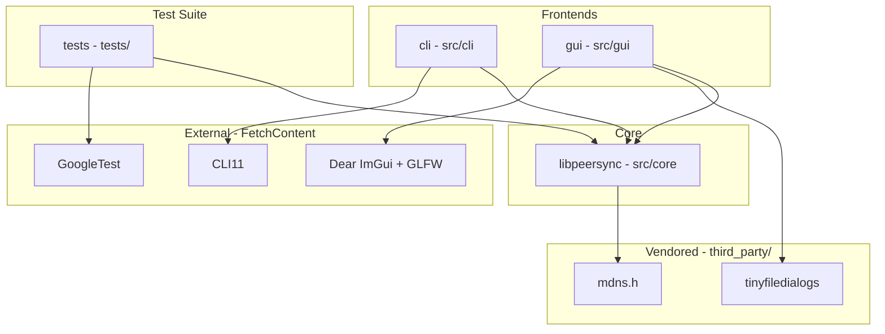

# Architecture and Dependency Graph

The **peersync** project is organized into a modular structure separating the core synchronization logic (`libpeersync`), user-facing frontends (`cli` and `gui`), and automated testing (`tests`).

## Dependency Graph



## Component Relationships

- **`cli` -> `libpeersync` -> `mdns.h`**: The command-line interface drives `libpeersync`, which utilizes `mdns.h` for local network peer discovery (mDNS / UDP broadcast). The CLI also depends on `CLI11` for argument parsing.
- **`gui` -> `libpeersync` + `tinyfiledialogs`**: The graphical interface drives `libpeersync` and directly incorporates `tinyfiledialogs` to provide native cross-platform file open, save, and folder selection dialogs without requiring heavy UI frameworks.
- **`tests` -> `libpeersync` + `GoogleTest`**: The test executable links against `libpeersync` and `GoogleTest` (fetched automatically via CMake) to verify core discovery and transfer routines.

## Wire Protocol

All direct peer-to-peer communication in **peersync** is built on top of a reliable TCP message framing foundation implemented in `libpeersync` (`src/core/message_framing.cpp`). Because TCP is a continuous byte stream without native packet boundaries, every message transmitted over the network is encapsulated using a fixed-size length prefix framing structure:

```
+-------------------------+-------------------------------+
|  Length Prefix (4 B)    |       Payload (N Bytes)       |
|  Big-Endian / Net Order |  Arbitrary Binary Payload     |
+-------------------------+-------------------------------+
```

1. **Length Prefix**: A 4-byte unsigned integer (`uint32_t`) encoded in network byte order (big-endian) specifying the exact number of bytes in the trailing payload (\(N\)).
2. **Payload**: Exactly \(N\) bytes of data. To guard against malformed length prefixes or denial-of-service memory exhaustion attacks, a sane maximum message size (`MAX_MESSAGE_SIZE = 64 MB`) is enforced. Any message claiming a length exceeding this constant is immediately rejected with a `PeerSyncNetworkException`.
3. **Stream Reassembly and Error Handling**: The receiving socket loops over `recv()` calls until exactly 4 bytes of prefix and \(N\) bytes of payload have been read. If a connection closes mid-message or truncates payload delivery, a `PeerSyncNetworkException` is thrown rather than returning partial or corrupted data. This framing serves as the universal transport foundation for all higher-level synchronization commands and chunk transfers.
