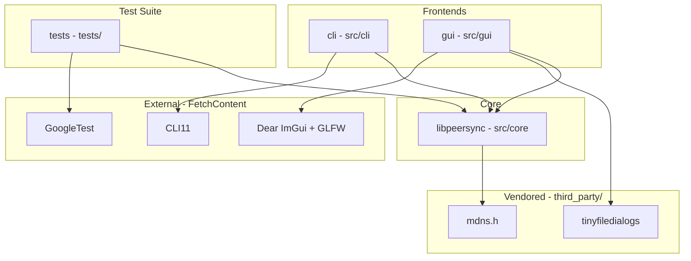

# Architecture and Dependency Graph

The **peersync** project is organized into a modular structure separating the core synchronization logic (`libpeersync`), user-facing frontends (`cli` and `gui`), and automated testing (`tests`).

## Dependency Graph

## Component Relationships

- **`cli` -> `libpeersync` -> `mdns.h`**: The command-line interface drives `libpeersync`, which utilizes `mdns.h` for local network peer discovery (mDNS / UDP broadcast). The CLI also depends on `CLI11` for argument parsing.
- **`gui` -> `libpeersync` + `tinyfiledialogs`**: The graphical interface drives `libpeersync` and directly incorporates `tinyfiledialogs` to provide native cross-platform file open, save, and folder selection dialogs without requiring heavy UI frameworks.
- **`tests` -> `libpeersync` + `GoogleTest`**: The test executable links against `libpeersync` and `GoogleTest` (fetched automatically via CMake) to verify core discovery and transfer routines.
