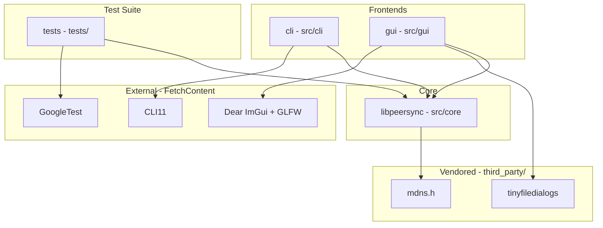

# Architecture and Dependency Graph

The **peersync** project is organized into a modular structure separating the core synchronization logic (`libpeersync`), user-facing frontends (`cli` and `gui`), and automated testing (`tests`).

## Dependency Graph



## Component Relationships

- **`cli` -> `libpeersync` -> `mdns.h`**: The command-line interface drives `libpeersync`, which utilizes `mdns.h` for local network peer discovery (mDNS / UDP broadcast). The CLI also depends on `CLI11` for argument parsing.
- **`gui` -> `libpeersync` + `tinyfiledialogs`**: The graphical interface drives `libpeersync` and directly incorporates `tinyfiledialogs` to provide native cross-platform file open, save, and folder selection dialogs without requiring heavy UI frameworks.
- **`tests` -> `libpeersync` + `GoogleTest`**: The test executable links against `libpeersync` and `GoogleTest` (fetched automatically via CMake) to verify core discovery and transfer routines.

## mDNS / DNS-SD Service Discovery

Peer discovery in **peersync** is handled via Multicast DNS (mDNS) and DNS-Based Service Discovery (DNS-SD, RFC 6763) implemented in `PeerAdvertiser` and `PeerBrowser` using the vendored `mdns.h` library.
- **Service Type**: Instances advertise and browse under the standard DNS-SD service type `_peersync._tcp.local.`.
- **Dynamic Port & Instance Naming**: Each advertiser dynamically binds to the actual runtime TCP port assigned to the `TcpSocket` listener and constructs its instance name (defaulting to the local machine's hostname).
- **PeerBrowser & Parsing**: `PeerBrowser` continuously searches the local network on a background thread, maintaining an active list of peers (`std::vector<DiscoveredPeer>`) accessible via polling (`getCurrentPeers()`) or a real-time callback (`std::function<void(const DiscoveredPeer&)>`). To ensure security against untrusted network input, packet decoding is extracted into pure, standalone functions (`parseMdnsResponsePacket`) that robustly reject truncated or malformed buffers without crashing.
- **Background Responder & Clean Shutdown**: Dedicated background threads in both `PeerAdvertiser` and `PeerBrowser` operate non-blocking sockets with short select timeouts (100ms). This guarantees that calling `stop()` or destroying the objects cleanly unblocks and shuts down threads without hanging.

### Manual Verification Pattern
> [!IMPORTANT]
> **Multicast Verification Constraint**: While packet construction, TXT record formatting, query matching, and malformed packet parsing are heavily covered by automated unit tests in `tests/test_discovery.cpp`, **full multicast advertise+browse behavior across machines is verified manually** rather than relied upon in automated CI.
>
> Automated CI build runners and container network namespaces frequently filter, restrict, or disable UDP multicast traffic on port 5353, making deterministic end-to-end multicast testing impossible across sandboxed CI environments. Cross-machine discovery is verified manually across real machines or two processes on a loopback interface (tested locally via `DiscoveryTest.LiveLoopbackDiscoveryAdvertiserAndBrowser`), consistent with the project's established pattern for network-hardware-dependent code.

## Wire Protocol

All direct peer-to-peer communication in **peersync** is built on top of a reliable TCP message framing foundation implemented in `libpeersync` (`src/core/message_framing.cpp`). Because TCP is a continuous byte stream without native packet boundaries, every message transmitted over the network is encapsulated using a fixed-size length prefix framing structure:

```
+-------------------------+-------------------------------+
|  Length Prefix (4 B)    |       Payload (N Bytes)       |
|  Big-Endian / Net Order |  Arbitrary Binary Payload     |
+-------------------------+-------------------------------+
```

1. **Length Prefix**: A 4-byte unsigned integer (`uint32_t`) encoded in network byte order (big-endian) specifying the exact number of bytes in the trailing payload (\(N\)).
2. **Payload**: Exactly \(N\) bytes of data. To guard against malformed length prefixes or denial-of-service memory exhaustion attacks, a sane maximum message size (`MAX_MESSAGE_SIZE = 64 MB`) is enforced. Any message claiming a length exceeding this constant is immediately rejected with a `PeerSyncNetworkException`.
3. **Stream Reassembly and Error Handling**: The receiving socket loops over `recv()` calls until exactly 4 bytes of prefix and \(N\) bytes of payload have been read. If a connection closes mid-message or truncates payload delivery, a `PeerSyncNetworkException` is thrown rather than returning partial or corrupted data. This framing serves as the universal transport foundation for all higher-level synchronization commands and chunk transfers.

### Protocol Message Types

Within the framed binary payload, the very first byte specifies the `MessageType` enum tag (`1` to `13`), allowing receivers to inspect and dispatch messages without full deserialization. The defined message types and their purposes are:

- **`Hello` (1)**: Exchanged upon initial connection establishment to advertise device identity and verify protocol version compatibility.
- **`PairChallenge` (2)**: Transmits a cryptographic challenge nonce to initiate secure peer pairing and authentication.
- **`PairResponse` (3)**: Returns the cryptographic response or hashed PIN to prove pairing authorization.
- **`PairResult` (4)**: Communicates the final success or failure status of a pairing authentication attempt.
- **`ManifestRequest` (5)**: Requests a full synchronization manifest for a specific directory or repository path.
- **`ManifestResponse` (6)**: Returns a catalog of remote file entries, including relative paths, file sizes, timestamps, and SHA-256 digests.
- **`DeltaInstructions` (7)**: Transmits block rolling-checksum instructions to enable delta-compressed synchronization of modified files.
- **`BlockData` (8)**: Transmits raw binary file chunk data for a specific file path and offset.
- **`TransferAck` (9)**: Acknowledges successful receipt and disk persistence of transmitted block bytes.
- **`ResumeRequest` (10)**: Inquires whether a partially interrupted file transfer can be resumed from a recorded offset.
- **`ResumeResponse` (11)**: Returns resume eligibility status and confirms the valid byte offset to continue transmission from.
- **`ErrorMessage` (13)**: Communicates protocol-level or filesystem errors (with numeric code and descriptive string) to the connected peer.

## Pairing & Trust Model

The **peersync** pairing mechanism (`src/core/pairing.cpp`) utilizes a random 6-digit numeric PIN (`generatePin()`) and PBKDF2-HMAC-SHA256 (`deriveSessionKey()`) to establish cryptographic authorization between connecting devices.

> [!IMPORTANT]
> **Scope Limitation — Authentication vs. Encryption**:
> The PIN-based pairing handshake authenticates that both sides know the same secret PIN before any file synchronization or manifest transfer proceeds. **It does NOT encrypt the file data or protocol traffic itself.**
>
> This is a known, deliberate scope limitation for the current local-network architecture rather than an oversight. Operating over private local area networks (LANs), the primary threat model addressed is preventing unauthorized local devices from initiating sync connections or reading file trees without user authorization. Encrypting the entire transport byte stream is a natural candidate for a future TLS-based enhancement (e.g., wrapping `TcpSocket` in TLS/SSL).

## Delta Sync Algorithm

When synchronizing large files that have been modified, **peersync** avoids transferring entire file contents over the network by utilizing an rsync-derived delta synchronization engine (`src/core/delta.cpp`). The algorithm operates in two phases: signature computation over the old file and rolling-window delta scanning over the new file.

```
Old File (Remote): [Block 0: Sig] [Block 1: Sig] [Block 2: Sig] ...
                         ^               ^
New File (Local):  [Literal Bytes] [Copied Block 1] [Literal Bytes] ...
```

### 1. Two-Tier Signature Computation (`computeSignatures`)
The destination peer divides its existing version of the file into non-overlapping sequential blocks of size `blockSize` (with the final block possibly shorter) and computes two cryptographic identifiers for each block:
- **Weak Rolling Checksum (Adler-32)**: A 32-bit checksum ($M = 65521$) that can be updated in $O(1)$ time as a sliding byte window moves across a file.
- **Strong Hash (xxHash64)**: A 64-bit non-cryptographic hash (`XXH64`) providing extremely low collision probability to confirm exact block content matches.

These signatures (`BlockSignature`) are sent to the source peer, which constructs an in-memory hash map keyed by weak checksum to enable $O(1)$ average-case candidate block lookups.

### 2. Rolling-Window Scanning (`computeDelta`)
The source peer scans the local modified file byte-by-byte using a sliding window of size `blockSize`:
1. **$O(1)$ Rolling Updates**: As the window shifts forward by one byte, the Adler-32 checksum is updated in $O(1)$ time (`rollAdler32`) by subtracting the outgoing byte's contribution and adding the incoming byte's contribution without recomputing from scratch.
2. **Two-Tier Match Verification**: At each window position, the rolling weak checksum is looked up in the signature hash map. On a hit, `xxHash64` is computed over the window and compared against candidate blocks to rule out weak-checksum collisions.
3. **Copy vs. Literal Emission**:
   - **On Match**: Any pending unmatched bytes accumulated before this point are emitted as a `Literal` instruction (`DeltaInstructionType::Literal`). Then, a `Copy` instruction (`DeltaInstructionType::Copy`) referencing the matched remote block index is emitted, and the scanning window advances by a full `blockSize`, skipping the matched region entirely.
   - **On Miss**: The leftmost byte of the window is appended to a pending literal buffer, and the window rolls forward by one byte.

### Why Rolling Checksums Beat Naive Fixed-Offset Diffing
A naive diffing algorithm that compares fixed file offsets (e.g., block 0 vs block 0, block 1 vs block 1) fails completely when bytes are **inserted or deleted** anywhere in the file. An insertion of even a single byte shifts all trailing data by one offset, causing all subsequent fixed-offset blocks to mismatch and forcing a full retransmission of unchanged content.

By using a **byte-by-byte rolling checksum**, the scanning window naturally re-synchronizes with remote block boundaries immediately after an insertion or deletion. Once the sliding window rolls past the modified bytes, it re-aligns with the original trailing blocks, hitting the hash map and emitting lightweight `Copy` instructions for all remaining unchanged content.

### Block Size Selection and Tradeoffs
The default block size in **peersync** is configurable (typically **64 KB** for large files and **4 KB** to **16 KB** for smaller datasets). Selecting the optimal block size involves a fundamental size/speed tradeoff:
- **Smaller Block Sizes (e.g., 4 KB - 16 KB)**:
  - **Pros**: Higher granularity. Small edits in localized regions result in less literal data transmission because fewer unchanged bytes are trapped inside a modified block.
  - **Cons**: Larger memory overhead and network payload for signature lists (more signatures per megabyte of file), and higher CPU overhead from more frequent hash map lookups.
- **Larger Block Sizes (e.g., 64 KB - 256 KB)**:
  - **Pros**: Extremely compact signature lists, minimal memory usage, and very high scanning throughput (fewer blocks to index and match).
  - **Cons**: Coarser granularity. A single byte edit forces retransmission of up to an entire `blockSize` literal buffer if no other block boundaries align.

